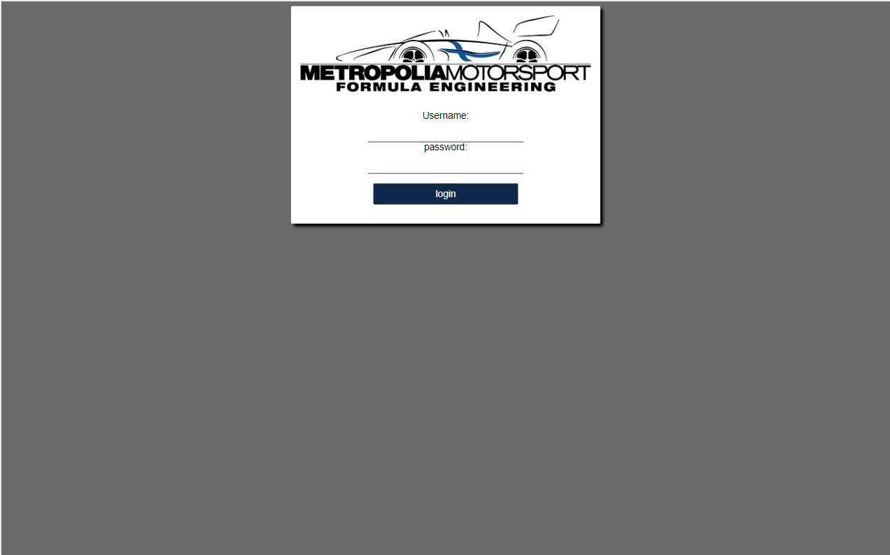
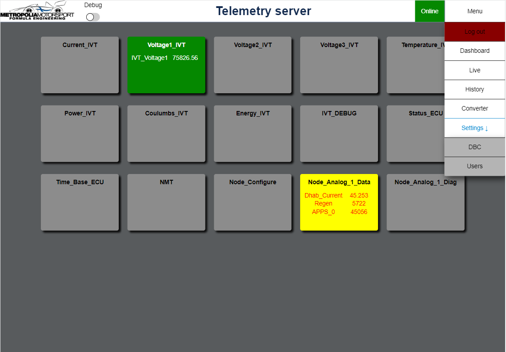
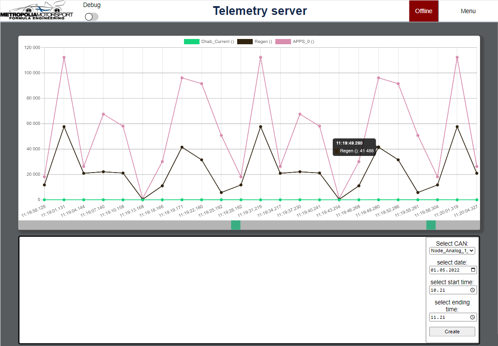
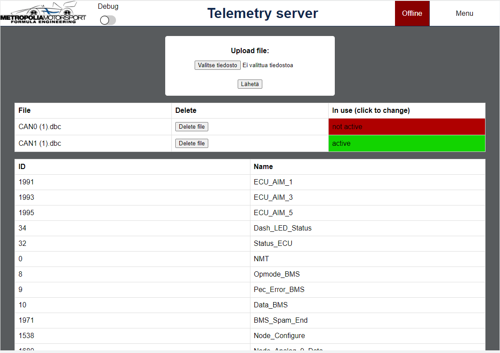
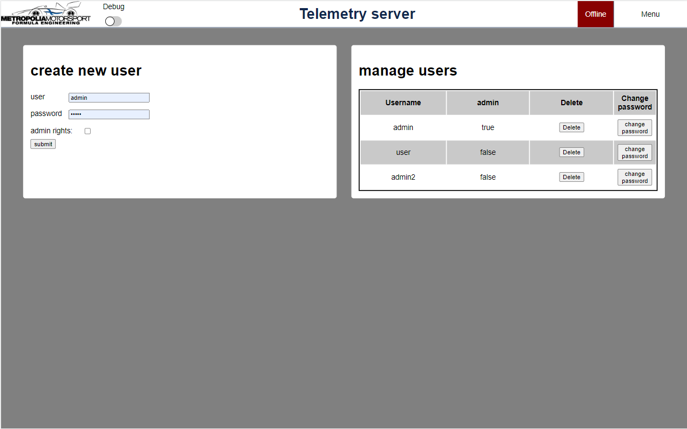

## Telemetry server
Telemetry server is a tool made for Metropolia Motorsport to monitor car's status. Server can receive live data from car and display it to clients.

## Motivation
Motivation behind this project is to make monitoring car easier. When car is driving around the track, team can monitor it's status and get useful data on how the car behaves. Server helps team to see immediately if car goes in to fault condition.

## Features
### **data handling**
Since car sends hexadecimal data from car using format:
 
```CAN1:DLC1:DATA1:CAN2:DLC2:DATA2:... etc.```

server must be able to receive this and convert it to real physical values.
Car sends data through MQTT broker, so server must listen to that.
  
For converting data, it is little more complicated. because data is sent in hexadecimal format from CAN node, this needs to be converted using **.dbc file.**
This file contains information and "decoding rules" for CAN data. Server has DBCParser that will handle this converting.

### **database**

It is wise to save data to database, so server uses Mongodb -database for that. Mongodb has a **datapoint** collection for saving datapoints using **dataPointModel**:
```
{
    CAN: { type: String, required: true },
    DLC: { type: Number, required: true },
    data: [{ type: mongoose.Types.ObjectId, ref: dataValueModel, required: true }],
    timestamp: { type: String, required: true }
}
```

Where data is saved to a **dataValue** collection using **dataValueModel**: 

```
{
    hexValue: { type: String, required: true },
    decValue: { type: Number, required: true },
    unit: { type: String, },
    name: { type: String }
}
```

 **users** collection is a collection where users are saved by using **userModel**:
```
{
    username: { type: String, unique: true },
    password: { type: String, required: true },
    rights: { type: Boolean, required: true }
}
```
Where **password** is hashed password and **rights** are admin rights.

**Settings** collection in database is used to save settings for easier server restarts. It has only one datapoint, where currently on active .dbc filename is saved.
When server restarts, it reads the filename and knows what file it needs to activate. When active .dbc file is changed, it will update this filename to correspond the new active file.
```
{
    activeDbc: { type: String, required: true },
}
 ```

 ### **Graphql API**

Server has Graphql api implemented. this is used to access database from client side.
**NOTE**: Before accessing any data, user must be authenticated.

### **Websocket**
When monitoring livedata, it is important for users to get new data as soon as possible. For this, server uses websockets. Server uses different websocket channels for sending different data:
- **debug** channel sends car data in the same format it has been received. If for any reasons data is corrupted, this channel also sends error messages.
 - **carStatus** channel sends car status. When server's MQTT client notices that new message is arrived, websocket sends notification that car is online. It does not matter if message is corrupted. If no messages has been received from car after 10 seconds, then notification is sent that car is offline.
  - **live** channel sends live data to clients. This contains real physical values of the car message and these real values are then displayed for user.

Websocket also has authentication methods implemented, for refusing non-wanted access.

### **Client**
Server has client-side where team members can monitor car and access database. Here are instructions for the client:

### log in:


Before accessing page and data, users must authenticate themselves.

### Dashboard:


This is the page users see when they log in. On top of the screen you can see navigation bar, that has a **debug switch**, which will log every car message and possible errors to browsers console. On right side, there is a **car status** that will show if car has sent any messages in the past 10 seconds. If not, it will be red and say *offline*. From **Menu**, user can navigate through the page or log out.

 From dashboard user can monitor every CAN node and see the latest value it has sent. If **card** is green, node is working correctly, when it is yellow, then there is a fault. Text color shows what value is faulty: Red means fault, black means that it is okay.


### Live:


In live user can monitor selected CAN node's values in a **linechart**. User can select **CAN node**, and how long the **X-axis** is: 10, 30, 60, 90, 120 or 180 seconds.

### History:


Since server can save data to database, it makes sence that team can observe that data.
In History page, users can select what **CAN node** data they want to observe, and from what **date** and **time**.

 After selecting these, user can zoom in and out for closer inspection using **green sliders** seen under the **linechart**.

 ### Converter:


In converter page, users can easily convert CAN node's hexadecimal data to real physical values by selecting wanted **CAN node** and inserting **hexadecimal string**.

### DBC Settings:


Because car sends hexadecimal values from CAN nodes, server must be able to read **.dbc files**. From this page users can observer what .dbc files are uploaded to server, and see what **CAN nodes** are included in the active .dbc file. 

**NOTE:** Only users with admin authorities are able to **upload**, **delete** or **change active** files.

### Users:


This page is only for the **admins**. Here admin can **create** new users or **delete** old ones. Admin can also **change passwords** for users.

## Tech/framework used
TBA


## Code Example
### Graphql
TBA

~~Show what the library does as concisely as possible, developers should be able to figure out **how** your project solves their problem by looking at the code example. Make sure the API you are showing off is obvious, and that your code is short and concise.~~

## Installation
TBA

~~Provide step by step series of examples and explanations about how to get a development env running.~~

## API Reference
TBA

~~Depending on the size of the project, if it is small and simple enough the reference docs can be added to the README. For medium size to larger projects it is important to at least provide a link to where the API reference docs live.~~

## Tests
TBA

~~Describe and show how to run the tests with code examples.~~

## How to use?
TBA

~~If people like your project they’ll want to learn how they can use it. To do so include step by step guide to use your project.~~

## Contribute
TBA

~~Let people know how they can contribute into your project. A [contributing guideline](https://github.com/zulip/zulip-electron/blob/master/CONTRIBUTING.md) will be a big plus.~~

## Credits

TBA
~~Give proper credits. This could be a link to any repo which inspired you to build this project, any blogposts or links to people who contrbuted in this project. ~~

#### Anything else that seems useful

## License
TBA

~~A short snippet describing the license (MIT, Apache etc)~~

MIT © [jannejki]()