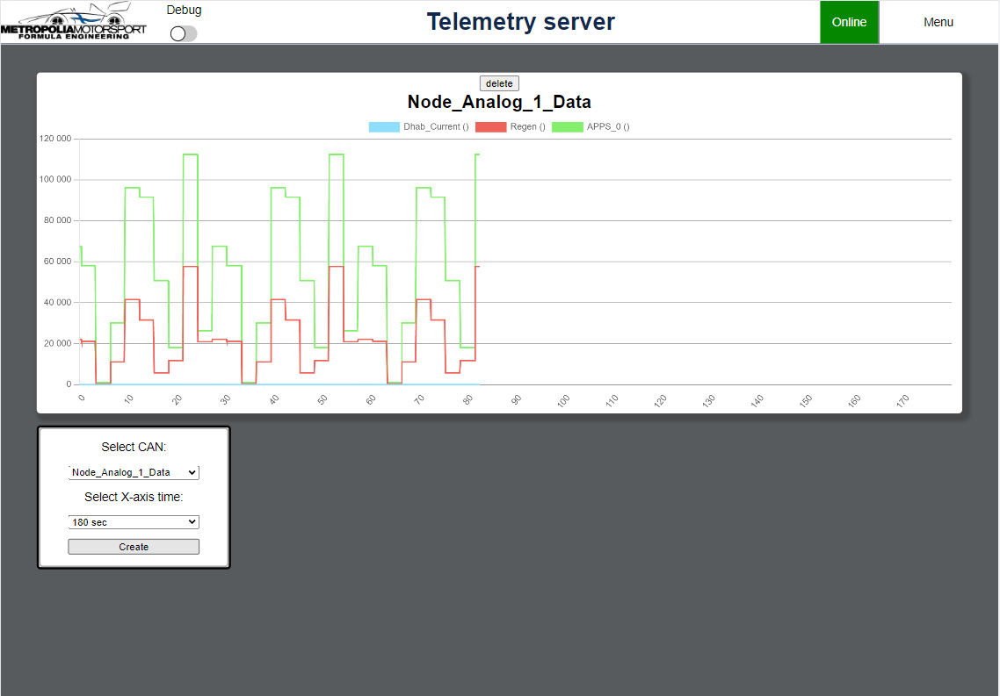

## Telemetry server
Telemetry server is a tool made for Metropolia Motorsport to monitor car's status. Server can receive live data from car and display it to clients.

## Motivation
Motivation behind this project is to make monitoring car easier. When car is driving around the track, team can monitor it's status and get useful data on how the car behaves. Server helps team to see immediately if car goes in to fault condition.

## Features
### **data handling**
Since car sends hexadecimal data from car using format:
 
```CAN1:DLC1:DATA1:CAN2:DLC2:DATA2:... etc.```

server must be able to receive this and convert it to real physical values.
Car sends data through MQTT broker, so server must listen to that.
  
For converting data, it is little more complicated. because data is sent in hexadecimal format from CAN node, this needs to be converted using **.dbc file.**
This file contains information and "decoding rules" for CAN data. Server has DBCParser that will handle this converting.

------------------------------------------------------
### **database**

It is wise to save data to database, so server uses Mongodb -database for that. Mongodb has a **datapoint** collection for saving datapoints using **dataPointModel**:
```
{
    CAN: { type: String, required: true },
    DLC: { type: Number, required: true },
    data: [{ type: mongoose.Types.ObjectId, ref: dataValueModel, required: true }],
    timestamp: { type: String, required: true }
}
```

Where data is saved to a **dataValue** collection using **dataValueModel**: 

```
{
    hexValue: { type: String, required: true },
    decValue: { type: Number, required: true },
    unit: { type: String, },
    name: { type: String }
}
```

 **users** collection is a collection where users are saved by using **userModel**:
```
{
    username: { type: String, unique: true },
    password: { type: String, required: true },
    rights: { type: Boolean, required: true }
}
```
Where **password** is hashed password and **rights** are admin rights.

**Settings** collection in database is used to save settings for easier server restarts. It has only one datapoint, where currently on active .dbc filename is saved.
When server restarts, it reads the filename and knows what file it needs to activate. When active .dbc file is changed, it will update this filename to correspond the new active file.
```
{
    activeDbc: { type: String, required: true },
}
 ```
 
---------------------------------------------------------------
 ### **Graphql API**

Server has Graphql api implemented. this is used to access database from client side.

**NOTE**: Before accessing any data, user must be authenticated.
When reading, adding, deleting or changing password of users, user must be authorized with admin rights.

For querying car data, user can query:
```
query DataPoint($dataPointId:  String, $can:  String, $dlc:  String, $data:  String, $startTime:  String, $endTime:  String)  {
	dataPoint(id:  $dataPointId, CAN:  $can, DLC:  $dlc, data:  $data, startTime:  $startTime, endTime:  $endTime)  {
		id
		CAN
		DLC
		timestamp
		data {
			id
			hexValue
			decValue
			unit
			name
		}
	}
}
```

For individual data values: 
```
query DataValue($dataValueId:  String, $hexValue:  String, $decValue:  String, $unit:  String, $name:  String)  {
	dataValue(id:  $dataValueId, hexValue:  $hexValue, decValue:  $decValue, unit:  $unit, name:  $name)  {
		id
		hexValue
		decValue
		unit
		name
	}
}
```

Admin can also delete datapoints, following mutation also deletes data values of the datapoints:

```
mutation Mutation($deleteDataPointId:  ID, $can:  String, $startTime:  String, $endTime:  String)  {
	deleteDataPoint(id:  $deleteDataPointId, CAN:  $can, startTime:  $startTime, endTime:  $endTime)  {
		id
		CAN
		DLC
		data  {
			name
			unit
			hexValue
			decValue
			id
		}
	}
}
```

Admins can query all users...
```
query Users($usersId:  String, $username:  String, $rights:  Boolean)  {
	users(id:  $usersId, username:  $username, rights:  $rights)  {
		id
		username
		rights
	}
}

```
add users...
```
mutation AddUser($rights:  Boolean, $password:  String, $username:  String)  {
	addUser(rights:  $rights, password:  $password, username:  $username)  {
		rights
		username
		id
	}
}
```
delete users...
```
mutation DeleteUser($deleteUserId:  String!)  {
	deleteUser(id:  $deleteUserId)  {
		rights
		username
		id
	}
}
```
or even change password for user:
```
mutation ChangePassword($changePasswordId:  String!, $password:  String!)  {
	changePassword(id:  $changePasswordId, password:  $password)  {
		rights
		username
		id
	}
}
```

Users can also query all CAN nodes from .dbc file:
```
query CanNodes($canId:  String, $name:  String)  {
	canNodes(canID:  $canId, name:  $name)  {
		canID
		name
		rules  {
			name
			startBit
			length
			endian
			scale
			offset
			min
			max
			unit
		}
	}
}
```
Because CAN nodes are read from active .dbc file, users are not able to delete or modify them.

-----------------------------------------------------------------------
### **Websocket**
When monitoring livedata, it is important for users to get new data as soon as possible. For this, server uses websockets. Server uses different websocket channels for sending different data:
- **debug** channel sends car data in the same format it has been received. If for any reasons data is corrupted, this channel also sends error messages.
 - **carStatus** channel sends car status. When server's MQTT client notices that new message is arrived, websocket sends notification that car is online. It does not matter if message is corrupted. If no messages has been received from car after 10 seconds, then notification is sent that car is offline.
  - **live** channel sends live data to clients. This contains real physical values of the car message and these real values are then displayed for user.

Websocket also has authentication methods implemented, for refusing non-wanted access.

------------------------------------------------------------------------
### **Client**
Server has client-side where team members can monitor car and access database. Here are instructions for the client:

### log in:


Before accessing page and data, users must authenticate themselves.

### Dashboard:


This is the page users see when they log in. On top of the screen you can see navigation bar, that has a **debug switch**, which will log every car message and possible errors to browsers console. On right side, there is a **car status** that will show if car has sent any messages in the past 10 seconds. If not, it will be red and say *offline*. From **Menu**, user can navigate through the page or log out.

 From dashboard user can monitor every CAN node and see the latest value it has sent. If **card** is green, node is working correctly, when it is yellow, then there is a fault. Text color shows what value is faulty: Red means fault, black means that it is okay.


### Live:


In live user can monitor selected CAN node's values in a **linechart**. User can select **CAN node**, and how long the **X-axis** is: 10, 30, 60, 90, 120 or 180 seconds.

### History:


Since server can save data to database, it makes sence that team can observe that data.
In History page, users can select what **CAN node** data they want to observe, and from what **date** and **time**.

 After selecting these, user can zoom in and out for closer inspection using **green sliders** seen under the **linechart**.

 ### Converter:


In converter page, users can easily convert CAN node's hexadecimal data to real physical values by selecting wanted **CAN node** and inserting **hexadecimal string**.

### DBC Settings:


Because car sends hexadecimal values from CAN nodes, server must be able to read **.dbc files**. From this page users can observer what .dbc files are uploaded to server, and see what **CAN nodes** are included in the active .dbc file. 

**NOTE:** Only users with admin authorities are able to **upload**, **delete** or **change active** files.

### Users:


This page is only for the **admin**. Here admin can **create** or **delete users** . Admin can also **change passwords** for users.

--------------------------------------------------------------------------
## Tech/framework used
Server is built using *node.js v16.14.1*. 
Database is *MongoDB 5.0.7-rc0 Community*.
For Graphql API, *apollo-server-express 3.6.7* is used.

All necessary frameworks and middlewares you can find in **package.json**.

--------------------------------------------------------------------
## Installation
Installing this server happens with the following steps:
 - Create [Mongodb database](https://www.mongodb.com/docs/launch-manage/).
     - Create **Telemetry** database to Mongodb.
     - Create user to Mongodb that has read/write rights to Telemetry. 
 - Create or use MQTT broker of your choice
- Load/Clone repository
- Install all dependencies found in **package.json**
- create **.env** file to ROOT folder
   - Write to the file following things: 
```
# address to Mongodb database
_URL=mongodb://xxx.xxx.xxx.xxx:port/Telemetry

# Secret word for securing sessions
SESSION_SECRET=YourSecretWord

# Salt rounds to hash passwords
SALT=xxx

# MQTT broker address
MQTT=mqtt:xxx.xxx.xxx.xxx:port

# MQTT client name
MQTT_CLIENT=clientName

#MQTT topic
MQTT_TOPIC=mqttTopic

# Is admin created
ADMIN=FALSE
``` 
- Start server with:
```node start```

- Now you should be able to go to *[localhost:3000/users](http://localhost:3000/users)*
    - Create admin user with admin rights by filling the form.
    -  You should get a notification that "user has been created"
    - **IMPORTANT:** After this, go to **.env**-file and change ```ADMIN=FALSE``` to ```ADMIN=TRUE```. This will enable admin authorization for creating new users. Remember to restart server.
 - Next go to *[localhost:3000](http://localhost:3000)* and sign in with the admin credentials you created.
 - Ignore *INTERNAL_SERVER_ERROR* warnings and navigate to *[settings/DBC](http://localhost:3000/settings)*
 - upload .DBC file using form. You should get ```{"status": "saved"}```.
 - Go back to settings and refresh page, then you should see uploaded .dbc file. click the red **not active** to activate file. You should get an alert "Settings ID: ...". 
 - Copy the ID and go to **.env**. Add new line: ```SETTINGS=[ID that you copied]```. This is the settings data that server uses when it restarts.
 - Now restart server.

If everything was done right, server should console log: 
```
Connected to database!
Server listening port 3000
[dbcFileCtrl] Active dbc-file: { activeDbc: [.dbc filename] }
connected to MQTT broker!
```

Now you are ready to monitor car status! Make sure that the car sends messages to same MQTT broker and topic that you have set server to listen to.

## License
MIT © jannejki
